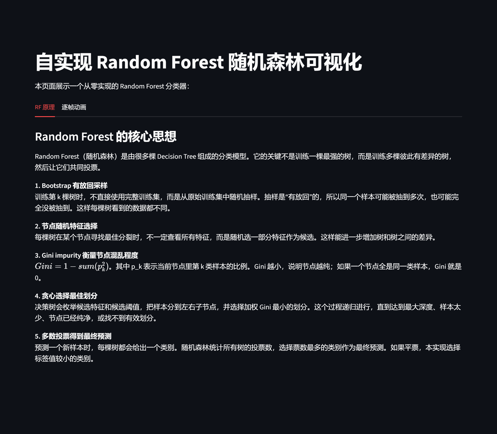
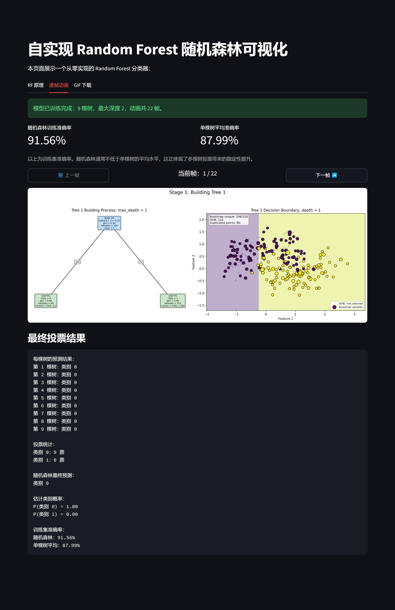
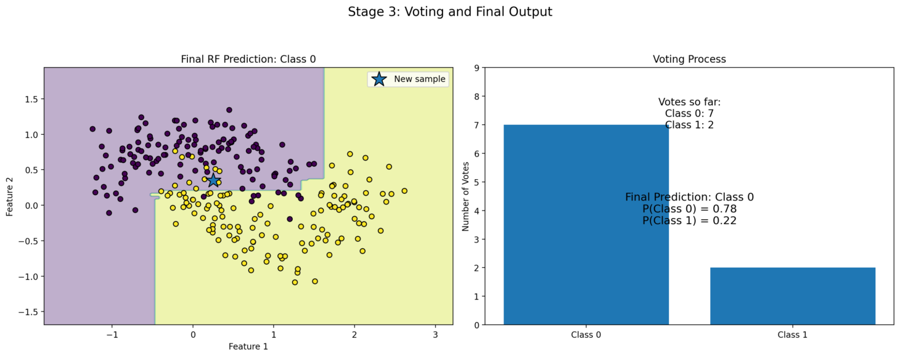

# RandomForestVisualizer

## Project Overview

RandomForestVisualizer 是一个使用 Streamlit 构建的 Random Forest 随机森林分类过程可视化项目。

本项目从零实现了二维分类数据生成、Decision Tree、Random Forest、Gini impurity、Bootstrap 采样和多数投票预测过程。

项目重点：通过逐帧动画展示随机森林从建树到投票的完整过程，帮助理解 Random Forest 的内部工作机制。

## Features

- 自实现 two-moons 风格二维分类数据生成
- 自实现 Decision Tree 分类器
- 自实现 Random Forest 分类器
- 使用 Gini impurity 选择最佳划分
- 使用 Bootstrap 有放回采样训练多棵树
- 每个节点支持随机选择部分特征参与划分
- 支持多棵树对新样本进行多数投票
- 使用 Streamlit 提供交互式参数控制
- 使用 Matplotlib 绘制树结构、分类边界和投票过程
- 支持上一帧 / 下一帧方式逐步查看完整动画

## Core Algorithm Explanation

项目的核心算法由两个部分组成：

1. **Decision Tree**
   - 每棵决策树由多个 `TreeNode` 节点组成。
   - 每个内部节点保存一个判断条件，例如某个特征是否小于等于某个阈值。
   - 每个叶子节点保存当前节点中样本的多数类别作为预测结果。
   - 建树时递归选择最佳划分，直到达到停止条件。
2. **Random Forest**
   - 随机森林由多棵 Decision Tree 组成。
   - 每棵树使用 Bootstrap 采样得到不同的训练数据。
   - 每个节点分裂时可以只随机考虑部分特征。
   - 预测时，每棵树分别预测类别，最后通过多数投票得到最终结果。

## Random Forest Steps

1. 生成二维 two-moons 风格分类数据。
2. 对每一棵树进行 Bootstrap 有放回采样。
3. 使用采样得到的数据训练一棵 Decision Tree。
4. 在每个节点中，根据 Gini impurity 寻找最佳划分。
5. 递归生成左右子树，直到达到最大深度、样本数过少、节点已经纯净或找不到有效划分。
6. 对新样本进行预测时，每棵树单独给出预测类别。
7. 统计所有树的预测结果。
8. 返回票数最多的类别作为 Random Forest 的最终预测。

## Gini Impurity Explanation

Gini impurity 用于衡量一个节点中样本类别的混乱程度。

公式为：

```text
Gini = 1 - sum(p_class^2)
```

其中 `p_class` 表示某个类别在当前节点中的比例。

如果一个节点中的所有样本都属于同一类，则：

```text
Gini = 0
```

这说明该节点是完全纯净的。

在寻找最佳划分时，程序会枚举候选特征和候选阈值，并计算划分后左右子节点的加权 Gini impurity：

```text
Weighted Gini =
(left_samples / total_samples) * Gini(left)
+
(right_samples / total_samples) * Gini(right)
```

程序会选择使加权 Gini impurity 最小的划分。

## Bootstrap Explanation

Bootstrap 是一种有放回随机采样方法。

在本项目中，训练每棵树时，程序都会从原始训练数据中随机抽取与原数据集大小相同的样本数量。由于采样是有放回的，所以：

- 同一个样本可能被抽中多次；
- 有些样本可能完全没有被抽中；
- 每棵树看到的训练数据都不完全相同。

这种随机性可以让森林中的多棵树产生差异，从而降低单棵树过拟合带来的影响。

## Majority Voting Explanation

Random Forest 在预测新样本时，会让每一棵树分别给出预测结果。

例如，9 棵树的预测结果可能是：

```text
Tree 1 -> Class 0
Tree 2 -> Class 1
Tree 3 -> Class 0
...
```

程序会统计每个类别获得的票数，然后选择票数最多的类别作为最终预测。

如果出现平票，本项目使用稳定规则：选择标签值较小的类别。

## Visualization Features

当前 `app.py` 使用 Streamlit 和 Matplotlib 实现完整过程可视化。

页面包含两个主要 tab：

1. **RF 原理**
   - 解释 Random Forest 的核心思想
   - 解释 Bootstrap 采样
   - 解释随机特征选择
   - 解释 Gini impurity
   - 解释最佳划分和多数投票
2. **逐帧动画**
   - Stage 1：展示 Tree 1 的建树过程和对应分类边界
   - Stage 2：逐棵展示森林中每棵树的结构和分类边界
   - Stage 3：展示新样本经过多棵树投票并得到最终预测的过程

侧边栏支持调整：

- 样本数量
- 数据噪声
- 数据随机种子
- 树的数量
- 每棵树最大深度
- 节点继续分裂所需最少样本数
- 每次分裂随机考虑的特征数
- 森林随机种子
- 待预测新样本坐标
- 分类边界网格精度

## Project Structure

当前项目使用 `src/` 组织核心算法与绘图工具，`app.py` 作为 Streamlit 可视化入口，`main.py` 作为命令行测试入口。

```text
RandomForestVisualizer/
├── docs/
├── src/
│   ├── __init__.py
│   ├── decision_tree.py
│   ├── metrics.py
│   ├── random_forest.py 
│   └── tree_node.py
├── app.py
├── main.py
├── README.md
├── requirements.txt
└── LICENSE
```

主要文件说明：

```
app.py
```

Streamlit 可视化界面入口，负责页面布局、参数交互、训练触发、逐帧动画展示和结果展示。

```
main.py
```

命令行版本入口，用于快速运行 Random Forest 训练、预测和投票结果输出。

```
src/tree_node.py
```

定义决策树节点结构，保存节点编号、深度、划分条件、Gini impurity、样本数量、类别统计和预测结果等信息。

```
src/decision_tree.py
```

从零实现 Decision Tree 分类器，包括 Gini impurity 计算、最佳划分搜索、递归建树和单样本预测路径记录。

```
src/random_forest.py
```

从零实现 Random Forest 分类器，包括 Bootstrap 采样、多棵决策树训练、随机特征选择和多数投票预测。


```
src/metrics.py
```

提供模型评估相关函数，例如 accuracy 计算。


```
docs/
```

用于保存项目文档和运行截图。

```
requirements.txt
```

记录项目运行所需的 Python 依赖。

```
LICENSE
```

项目许可证文件。

## Installation

建议使用 Python 虚拟环境运行项目。

### 1. Create virtual environment

Windows PowerShell:

```powershell
python -m venv .venv
.venv\Scripts\Activate.ps1
```

macOS / Linux:

```bash
python3 -m venv .venv
source .venv/bin/activate
```

### 2. Install dependencies

```bash
pip install numpy matplotlib streamlit pillow
```

## Usage

在项目根目录下运行：

```bash
streamlit run app.py
```

运行后，在浏览器中打开 Streamlit 页面。

使用步骤：

1. 在左侧 sidebar 调整数据和模型参数。
2. 点击 **训练并生成逐帧动画**。
3. 进入 **逐帧动画** tab。
4. 使用 **上一帧** 和 **下一帧** 按钮查看随机森林完整过程。
5. 在页面下方查看每棵树的预测结果、投票统计和最终预测类别。

## Statement

引用/AI辅助说明：

本项目项目结构来自`AssignmentP.md`的指导；项目核心实现代码`decision_tree.md` 和 `random_forest.py`为本人在AI指导下创建，主要在调用不熟悉的库以简便代码实现方面进行辅助。可视化项目的具体调用为AI创建代码。

本项目使用`GPT-5.5 `辅助完成。

## Screenshots

### RF 原理页面



### 逐帧动画页面



### 最终投票结果



